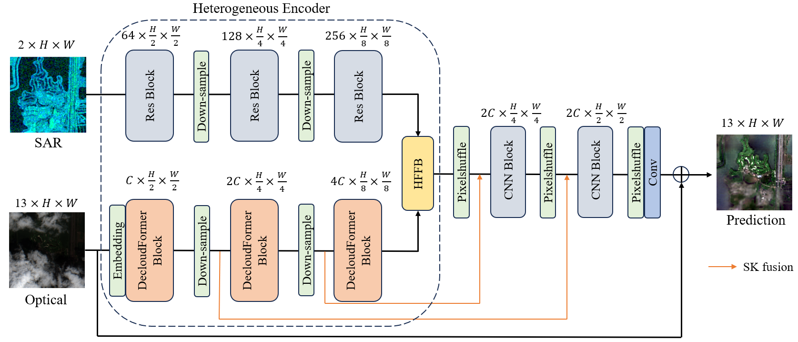

<div align="center">
<h1>HPN-CR: Heterogeneous Parallel Network for SAR-Optical Data Fusion Cloud Removal</h1>
</div>

This repository contains the codes for the paper "HPN-CR: Heterogeneous Parallel Network for SAR-Optical Data Fusion Cloud Removal" 

## Paper Reference
If you use the codes for your research, please cite us accordingly:

```

```
## 1. INTRODUCTION

This is the source code of [***HPN-CR: Heterogeneous Parallel Network for SAR-Optical Data Fusion Cloud Removal***]. In this work, a heterogeneous parallel network for cloud removal (HPN-CR) is proposed to achieve effective cloud removal in high cloud coverage scenarios.

The architecture of *HPN* is shown as follows.

<div align="center"></div>


## 2. DATASET

We ues the public large-scale dataset named SEN12MS-CR, which contains triplets of cloudy Sentinel-2 optical images, cloud-free Sentinel-2 optical images and Sentinel-1 SAR images.

You can get more details about this dataset at [here](https://mediatum.ub.tum.de/1554803) and directly download the source SEN12MSCR dataset at [download](https://mediatum.ub.tum.de/1554803). 

All ROIs were divided into training, validation, and test datasets as well as [PatrickTUM](https://github.com/PatrickTUM/SEN12MS-CR-TS). You can also directly refer to `SEN12MS-CR/split.txt`.

You need to place the files from the source SEN12MSCR dataset into the corresponding source_folder under train, test, and val based on the above division, and then run :
```
python SEN12MS-CR/get_images.py
```

Finally, batch rename all the images to remove the "s1", "s2", and "s2_cloudy" markers from their names. 

🚀 **The processed test portion can be downloaded directly from [here](https://aistudio.baidu.com/datasetdetail/316553).**

The constructed file structure in your computer should be shown as follows: 
```
./
+-- SEN12MS-CR
    +--	train
        +-- s1
        |   +-- ROIs1158_spring_1_p30.tif
        |   +-- ...
        +-- s2_cloudfree
        |   +-- ROIs1158_spring_1_p30.tif
        |   +-- ...
        +-- s2_cloudy
        |   +-- ROIs1158_spring_1_p30.tif
        |   +-- ...
        +-- data.csv
     +-- val
        +-- s1
        |   +-- ROIs2017_winter_22_p30.tif
        |   +-- ...
        +-- s2_cloudfree
        |   +-- ROIs2017_winter_22_p30.tif
        |   +-- ...
        +-- s2_cloudy
        |   +-- ROIs2017_winter_22_p30.tif
        |   +-- ...
        +-- data.csv
     +-- test
        +-- s1
        |   +-- ROIs1158_spring_31_p30.tif
        |   +-- ...
        +-- s2_cloudfree
        |   +-- ROIs1158_spring_31_p30.tif
        |   +-- ...
        +-- s2_cloudy
        |   +-- ROIs1158_spring_31_p30.tif
        |   +-- ...
        +-- data.csv
```


## 3. Installation
```
conda create -n hpn-cr python==3.8
conda activate hpn-cr
pip install torch==2.0.1 torchvision==0.15.2 torchaudio==2.0.2 --index-url https://download.pytorch.org/whl/cu118
pip install -r requirments.txt
```

## 4. Get Started
You can download the pretrained model from [here](https://drive.google.com/file/d/1JV_amiRn6QPb64O4fnNreSynQX1V_cqo/view?usp=drive_link) and put it in './backup'.

Use the following command to test the neural network:
```
python test.py --weight_path ./backup/weight.pth
```

## 5. CONTACT

We are glad to hear if you have any suggestions and questions.

E-mail: gpz@bit.edu.cn
